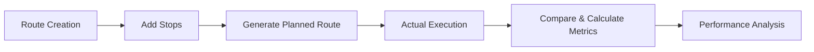

# **Route Optimization API Documentation**

## **Overview**

FastAPI backend for managing delivery routes, comparing planned vs actual executions, and calculating performance metrics.

## **API Endpoints**

| Method | Endpoint                                     | Description                      | Response Model                       |
| ------ | -------------------------------------------- | -------------------------------- | ------------------------------------ |
| `GET`  | `/routes/all`                                | Get all routes with stop counts  | `List[RouteResponseWithStopsCount]`  |
| `GET`  | `/routes/total_routes_and_stops`             | Get total routes and stops count | `RouteResponseWithRouteAndStopCount` |
| `GET`  | `/routes`                                    | Paginated routes                 | `List[RouteResponseWithStopsCount]`  |
| `GET`  | `/routes/{route_id}`                         | Get single route details         | `RouteResponse`                      |
| `GET`  | `/routes/{route_id}/stops`                   | Get all stops for a route        | `List[StopResponse]`                 |
| `GET`  | `/routes/{route_id}/actual`                  | Get actual execution sequence    | `List[ActualStopResponse]`           |
| `POST` | `/routes/{route_id}/generate/planned_routes` | Generate optimal planned route   | `PlannedRouteResponse`               |
| `GET`  | `/routes/{route_id}/comparison`              | Compare planned vs actual        | Comparison data                      |
| `GET`  | `/routes/{route_id}/metrics`                 | Get route performance metrics    | `RouteMetricResponse`                |

## **Data Flow**



### **1. Route Setup**

1. **Create Route** → `/routes/{route_id}` (implicit)
2. **Add Stops** → `/routes/{route_id}/stops` (populate stops table)
3. **Generate Plan** → `POST /routes/{route_id}/generate/planned_routes`
   - Uses `RoutePlanner` algorithm
   - Saves to `planned_route_sequence` table

### **2. Execution & Analysis**

4. **Record Actual** → External system records actual stops sequence
5. **Get Comparison** → `GET /routes/{route_id}/comparison`
   - Calculates: distances, order matches, prefix matches
   - Saves metrics to `route_metrics` table
6. **View Metrics** → `GET /routes/{route_id}/metrics`

## **Key Features**

### **Route Planning**

- **Algorithm**: `RoutePlanner.generate_planned_route()`
- **Input**: Route details + unordered stops
- **Output**: Optimized stop sequence
- **Storage**: `planned_route_sequence` table

### **Performance Metrics**

Calculated in comparison endpoint:

- **Distance Analysis**: Planned vs actual distances with deltas
- **Order Matching**: Percentage of stops in correct sequence
- **Prefix Match**: Consecutive matches from start
- **Scoring**: Route score (A/B/C) based on performance

### **Data Models**

```python
# Core response models
RouteResponse                # Basic route info
StopResponse                 # Stop location (lat/lng, type)
ActualStopResponse          # Actual execution sequence
PlannedRouteResponse        # Optimized plan
RouteMetricResponse         # Performance metrics
```

## **Usage Examples**

### **1. Get All Routes (Paginated)**

```bash
GET /routes?skip=0&limit=10
```

Returns first 10 routes with stop counts.

### **2. Generate Planned Route**

```bash
POST /routes/route_123/generate/planned_routes
```

Triggers optimization algorithm, saves planned sequence.

### **3. Compare Performance**

```bash
GET /routes/route_123/comparison
```

Returns:

```json
{
  "route": {...},
  "planned_route": [...],
  "actual_route": [...],
  "metrics": {
    "total_planned_distance_km": 15.2,
    "total_actual_distance_km": 16.8,
    "order_match_percentage": 85.7,
    "route_score": "B"
  }
}
```

### **4. Get Metrics Only**

```bash
GET /routes/route_123/metrics
```

Returns pre-calculated performance metrics.

## **Error Handling**

- **404**: Route not found
- **404**: No stops found (for planning)
- **404**: Metrics not calculated yet

## **Dependencies**

- **Database**: PostgreSQL with spatial support
- **ORM**: SQLAlchemy
- **API**: FastAPI with Pydantic models
- **Algorithm**: Custom `RoutePlanner` for optimization

## **Quick Start**

1. **Create route** (implicit in database)
2. **Add stops** to route
3. **Generate planned sequence**
4. **Execute route** (record actual sequence)
5. **Compare** to get metrics
6. **Monitor** performance via metrics endpoint

This API enables complete route lifecycle management from planning through execution to performance analysis.
