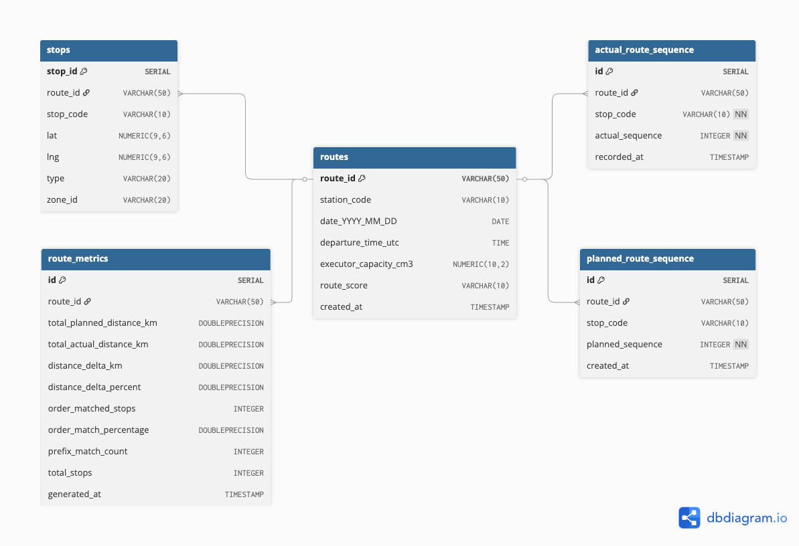

# **Route Optimization DB Schema**

## **ERD**



## **Core Tables**

### **1. `routes`** - Master route info

```sql
route_id (PK), station_code, date, departure_time,
executor_capacity_cm3, route_score (A/B/C), created_at
```

**Indexes**: `date`, `station_code`

### **2. `stops`** - All stop locations

```sql
stop_id (PK), route_id (FK→routes), stop_code, lat, lng,
type (delivery/pickup/depot), zone_id
```

**Unique**: `(route_id, stop_code)`
**Index**: `route_id`

### **3. `planned_route_sequence`** - Optimized plan

```sql
id (PK), route_id (FK→routes), stop_code, planned_sequence (1,2,3...)
```

**Unique**: `(route_id, stop_code)`

### **4. `actual_route_sequence`** - Real execution

```sql
id (PK), route_id (FK→routes), stop_code, actual_sequence, recorded_at
```

**Unique**: `(route_id, stop_code)`

### **5. `route_metrics`** - Performance analytics

```sql
id (PK), route_id (FK→routes, unique),
total_planned_distance_km, total_actual_distance_km,
distance_delta_km, distance_delta_percent,
order_matched_stops, order_match_percentage, prefix_match_count
```

**1:1** with routes

## **Key Relationships**

```
routes ┬──── stops
       ├──── planned_route_sequence
       ├──── actual_route_sequence
       └──── route_metrics (1:1)
```

## **How It Works**

### **Workflow:**

1. **Plan**: Insert route → stops → planned sequence
2. **Execute**: Record actual sequence as stops visited
3. **Analyze**: Compute metrics comparing planned vs actual

### **Critical Queries:**

**Get route with actual sequence:**

```sql
SELECT s.lat, s.lng, a.actual_sequence
FROM actual_route_sequence a
JOIN stops s ON a.route_id = s.route_id
             AND a.stop_code = s.stop_code
WHERE a.route_id = 'ROUTE_ID'
ORDER BY a.actual_sequence;
```

**Compare planned vs actual:**

```sql
SELECT p.stop_code, p.planned_sequence, a.actual_sequence
FROM planned_route_sequence p
LEFT JOIN actual_route_sequence a ON p.route_id = a.route_id
                                  AND p.stop_code = a.stop_code
WHERE p.route_id = 'ROUTE_ID';
```

## **Design Benefits**

- **Normalized**: Stops separate from sequences
- **Fast**: Indexed on route_id, date
- **Analytics-ready**: Pre-computed metrics
- **Integrity**: Foreign keys with CASCADE delete

## **Use Cases**

- **Route optimization**: Compare algorithm plan vs reality
- **Driver performance**: Measure sequence compliance
- **Capacity planning**: Analyze vehicle utilization
- **Quality scoring**: Route grades (A/B/C) with detailed metrics

## **Quick Stats**

- **5 tables**, **8 indexes**
- **1:many** routes→stops, routes→sequences
- **1:1** routes→metrics
- Supports **date-based** partitioning if needed
